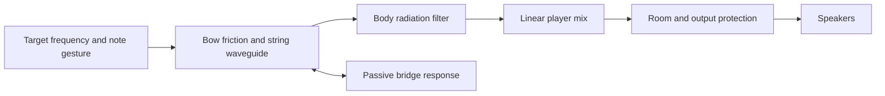

+++
id = "n0002"
title = "Bowed synthesis research"
+++

# Bowed synthesis research

Research for t0009, 2026-09-13. This is an engineering recommendation, not a claim that a new instrument has been implemented or sounds realistic.

## Principles

- Accept continuous target frequencies, preserve musical tuning, and use no soundfonts.
- Establish convincing dry string character and clean polyphony before adding ensemble size and room sound.
- Keep physical excitation, body response, expressive control, spatial sound and output protection separate.
- Treat listening as the acceptance criterion for realism. Pitch, level and stability tests are necessary but cannot certify instrument identity.

## Findings in the current implementation

`packages/audio/src/string-model.ts` constructs a harmonic wavetable with broad spectral bumps. It has no string feedback loop, bow friction state, or time-domain body response. It therefore does not simulate bow/string interaction. Its three broad formants and harmonic roll-off are an approximation of a spectral envelope, not a calibrated violin or cello.

Every generated voice starts at phase zero with the same 5.2 Hz vibrato function and random seed. Same-frequency/duration requests reuse the exact same buffer. The harmonic amplitudes are fixed for the note, including while vibrato changes its instantaneous frequency; a real fixed body response can turn pitch modulation into changing harmonic amplitudes. These observations are established from code. Their contribution to the reported brass-like perception is a hypothesis requiring listening comparisons.

`packages/audio/src/bowed-string.ts` sends the mixed voices through a compressor and a memoryless tanh waveshaper. The waveshaper introduces intermodulation between notes. This is distinct from the wanted nonlinearity at each player's bow contact.

### Controlled mixer diagnostic

Run `node docs/research/audio-mix-diagnostic.mjs` from the repository root. The diagnostic reproduces the current 2,049-point output curve with linear interpolation. It uses one second of 437 Hz and 563 Hz sine waves at 48 kHz; neither source contains the measured third-order products at 311, 689, 1,437 or 1,563 Hz.

| Peak amplitude of each input sine | Shared curve: each measured product relative to the 437 Hz output |
| --------------------------------- | ----------------------------------------------------------------- |
| 0.10                              | −50.31 dBc                                                        |
| 0.25                              | −34.88 dBc                                                        |
| 0.40                              | −27.55 dBc                                                        |

With separate curves before mixing, these particular products stay below −200 dBc in the numerical experiment. This isolates the mathematical interaction; it excludes the compressor, Web Audio oversampling, actual chord spectra and acoustic playback. It neither measures the application's actual distortion level nor proves the cause of perceived brassiness. Separate waveshapers are a diagnostic comparison, not the proposed instrument design.

## What the research supports

### Bow interaction and string propagation

A digital waveguide propagates waves between the bow, bridge and finger/nut. At the bow, string velocity feeds back into a nonlinear friction interaction. Bow speed, force and position determine the resulting oscillation. Fractional delays allow continuous pitch and bow-position control. This supplies a concrete physical excitation mechanism missing from the current wavetable. [Smith, digital waveguide bowed string](https://www.dsprelated.com/freebooks/pasp/Digital_Waveguide_Bowed_String.html), [bow/string scattering junction](https://www.dsprelated.com/freebooks/pasp/Bow_String_Scattering_Junction.html).

A simple friction table is a baseline, not sufficient evidence of realism. Galluzzo, Woodhouse and Mansour compared models against measured transients: the temperature-based friction model performed better than instantaneous sliding-speed models, but none captured every important detail. Their results also distinguish stable motion from multiple slipping and raucous regimes. A usable instrument needs calibrated bowing trajectories, not arbitrary pressure and speed values. [Assessing friction laws for simulating bowed-string motion, 2017](https://api.repository.cam.ac.uk/server/api/core/bitstreams/d7446362-cc0c-4385-9030-9c1e745e5458/content).

Finite bow width can produce differential slipping and audible noise. It gives a physically grounded path for improving bow texture beyond adding unrelated white noise. Add this complexity only if simpler excitation still fails listening tests. [Serafin and Smith, finite-width bow model, 2000](https://www.dafx.de/paper-archive/2000/pdf/Serafin_Stefania_paper.pdf).

### Body and radiation

The bridge's mechanical response and the body-to-air radiation response are different quantities. Maestre, Scavone and Smith fit measured bridge admittances using modal parameters and physically constrained models. Such a model belongs at the string termination and must preserve passive behavior; it is not automatically a microphone-output filter. [Measured violin-family bridge admittances, 2013](https://mtg.upf.edu/system/files/publications/smac_adm_2013_v3.pdf).

Woodhouse's virtual-violin examples separately combine bridge-force signals with measured body responses by convolution. His discussion explicitly warns that unrealistic synthesized violin signals can overwhelm listeners' judgments about other properties. The instrument body needs its own frequency-dependent response and decay, including meaningful peaks and dips. [Virtual-violin listening experiments](https://euphonics.org/6-5-making-a-difference/), [signature modes and formants](https://euphonics.org/5-3-signature-modes-and-formants/).

Recommendation: use distinct violin/cello body profiles represented by stable resonator/filter coefficients, calibrated from published or suitably licensed measurements. A fixed body impulse response is another representation of this filter; it is not a bank of pitched notes. It can process a string excited at any supported frequency. Keep body modes fixed when target pitch changes. Any measured coefficients or impulse responses still need provenance and sample-rate handling before adoption; none have been imported here.

### Expressive sections

Synful's published design separates note transitions, harmonic/noise synthesis, player variation and room placement. It also distributes a player section across chord notes rather than multiplying a whole orchestra for every key. It relies on recorded phrase data, so it is evidence about architecture and control, not a sample-free implementation to adopt. [Synful technology](https://www.synful.com/technology).

For this tool, I propose bounded independent players with distinct bow gestures, vibrato trajectories, noise states and body variations. Keep each target pitch as the tuning center; constrain variation so it does not obscure unusual intervals. Every chord note must remain represented. Add a restrained room after the dry instrument is convincing, and assess the mono sum because mobile playback cannot rely on stereo width.

## Alternatives and selection

| Approach                                     | Assessment for Rechorder                                                                                                                                                                                                                              |
| -------------------------------------------- | ----------------------------------------------------------------------------------------------------------------------------------------------------------------------------------------------------------------------------------------------------- |
| Dynamic additive/noise synthesis             | Can be expressive with rich time-varying control; the present static spectral approximation is inadequate. MIDI-DDSP demonstrates a more involved learned hierarchy, but training data, model delivery and generalization would add substantial work. |
| Bowed digital waveguide plus calibrated body | Recommended first prototype: direct frequency control, compact state, and explicit physical bow controls. Friction and body calibration remain the hard parts.                                                                                        |
| Modal physical string solver                 | Strong alternative if waveguide articulation or tuning fails. A 2022 non-iterative method reports faster-than-real-time stiff-string synthesis in its experiments. That is not evidence of mobile, browser or ensemble performance.                   |
| Full spatial string/body simulation          | Useful as a reference for complex coupling; unnecessary implementation scope for the first browser prototype.                                                                                                                                         |

Sources for the compared alternatives: [MIDI-DDSP](https://arxiv.org/abs/2112.09312), [Russo, Ducceschi and Bilbao, efficient modal bowed-string simulation, 2022](https://dafx2020.mdw.ac.at/proceedings/papers/DAFx20in22_paper_14.pdf). The modal paper's favorable numerical results should not be generalized into an unconditional stability guarantee for arbitrary friction laws or parameters.

## Proposed implementation path

1. **Build a dry solo prototype.** Separate the string/exciter from the body. Start with a documented waveguide baseline and compare its attack, sustain and release with reference bowed recordings. STK's `Bowed` is a useful reference, explicitly described by Smith as a starting point for refinements. Do not equate porting it with finishing a realistic instrument. [STK source](https://github.com/thestk/stk/blob/master/src/Bowed.cpp), [Smith's extension discussion](https://www.dsprelated.com/freebooks/pasp/Bowed_String_Synthesis_Extensions.html).
2. **Tune the physical controls and pitch.** Use fractional delay and compensate loop-filter phase; measure the actual steady-state fundamental because bow interaction can alter the oscillation. Test frequencies between conventional notes, short attacks and the entire supported register. Oversample nonlinear excitation if aliasing requires it. Refine friction toward dynamic/thermal behavior when the comparisons justify it.
3. **Make chords clean and expressive.** Introduce independent player states and a bounded section allocation. Use a linear summing path with headroom and controlled gain; reserve a transparent limiter for exceptional peaks instead of continuously coloring the sum. Preserve the current audio-clock scheduling and cancellation contract.
4. **Add scale through space.** Compare dry solo, dry section and section-with-room at matched loudness. Keep early detail and mono audibility; room duration and player count are audition parameters, not settled defaults.
5. **Integrate real-time rendering.** Stream synthesis in an AudioWorklet with preallocated state and sample-accurate events. Profile JavaScript first; use a WebAssembly kernel if measured polyphonic cost requires it. Avoid synthesizing an entire held note on the UI thread. Chrome's guidance describes both worklet/WASM integration and the cost of allocation/message traffic on the audio path. [Audio Worklet design patterns](https://developer.chrome.com/blog/audio-worklet-design-pattern?hl=en).

At 48 kHz, 128 samples span about 2.67 ms; all graph processing has to meet its actual render deadline. This is a scheduling constraint, not a performance result. Preserve responsiveness during cold initialization, dense chords, rapid replacement, held notes and release tails. Build coefficients for the actual sample rate and keep the processor independent of tuning and UI data.

## Acceptance and limits

- Compare the existing sound, the dry physical prototype, and its section/room variants using matching pitches, durations and loudness. Include solo notes, close dyads, major/minor chords, dense altered/slash chords and arbitrary-frequency intervals. Evaluate attack separately from sustain; include repeated notes and rapid chord changes.
- Ask listeners to judge bowed-string identity, harshness in chords, pitch clarity and sense of scale independently. A louder or wetter variant must not win by default.
- Retain regression checks for pitch, non-finite values, CPU/underruns, cancellation, output headroom and speaker-band energy. Include sustained operation, actual iOS/Android speakers, headphones and mono playback.
- A model can accept arbitrary frequencies within a practical range without guaranteeing that every frequency sounds like a physically playable violin or cello. Preserve frequency freedom and be explicit about the tested register.
- No replacement audio model, listening comparison or mobile performance benchmark was produced in this research task. The next useful deliverable is an auditionable physical prototype with a level-matched comparison, not another unverified production timbre claim.

One factual clarification: SoundFont engines can support microtuning; FluidSynth accepts per-key pitch values in cents. Arbitrary tuning alone does not disqualify them. The requested no-soundfont approach is retained, and the proposed physical model works directly with frequency. [FluidSynth tuning API](https://www.fluidsynth.org/api/group__tuning.html).
